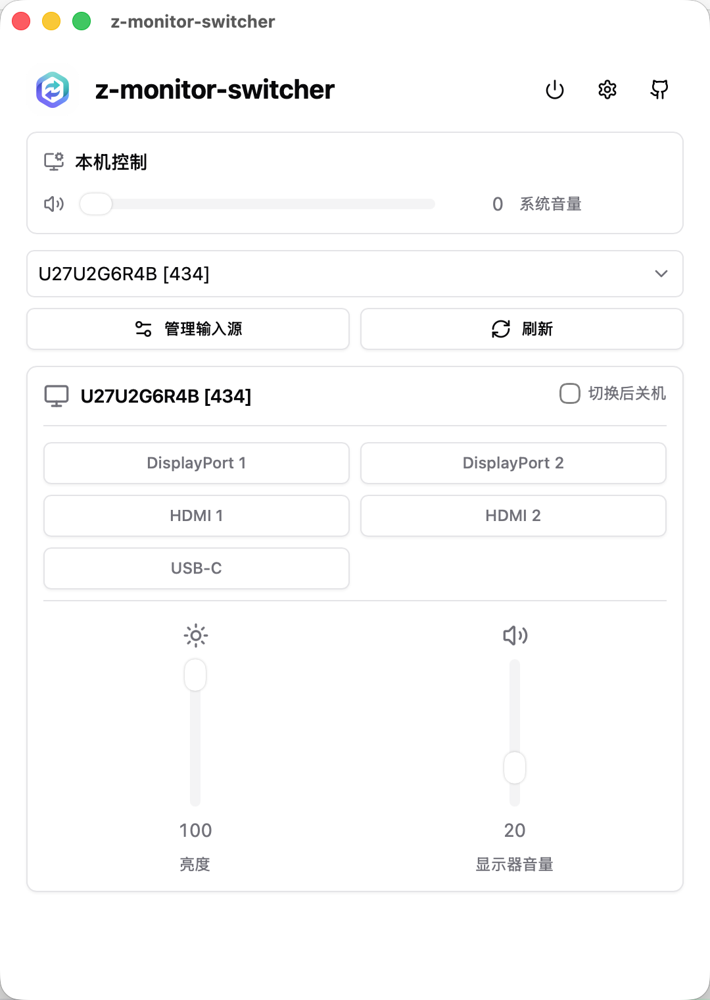

# Z Monitor Switcher

[English](README_EN.md) | 简体中文

一个跨平台的外接显示器控制工具，支持通过 DDC/CI 协议切换输入源、调节亮度和音量。特别适合使用 KVM 或多台电脑共享一台显示器的用户。

<div align="center">
  
</div>

## ✨ 主要功能

- 🔄 **输入源快速切换** - 一键在不同输入源（HDMI、DisplayPort、USB-C 等）之间切换
- 🔆 **亮度调节** - 直接控制外接显示器的硬件亮度
- 🔊 **音量控制** - 调节显示器内置扬声器音量和系统音量
- ⌨️ **全局快捷键** - 为常用输入源设置快捷键，快速切换
- 🎯 **菜单栏/托盘快捷操作** - 无需打开主窗口即可快速调节
- 🔌 **热插拔支持** - 自动检测显示器连接变化（macOS）
- 🚀 **开机自启** - 可选择开机自动启动

## 📥 下载安装

### macOS
1. 从 [Releases](https://github.com/goalonez/z-monitor-switcher/releases) 下载最新的 `.dmg` 文件
2. 打开 DMG 文件，将应用拖入 Applications 文件夹
3. 首次打开时，右键点击应用选择"打开"（或在"系统设置 → 隐私与安全性"中允许）

如果仍无法打开，可在终端中仅对已安装的 app bundle 解除 quarantine：

```bash
sudo xattr -dr com.apple.quarantine "/Applications/Z Monitor Switcher.app"
```

请不要对整个 `/Applications/` 目录执行该命令。

**系统要求**：macOS 12.0+ (Apple Silicon)

### Windows
1. 从 [Releases](https://github.com/goalonez/z-monitor-switcher/releases) 下载最新的 `.exe` 安装包
2. 运行安装程序
3. 如遇到 SmartScreen 警告，点击"更多信息 → 仍要运行"

**系统要求**：Windows 10/11

### Linux / Ubuntu
1. 从 [Releases](https://github.com/goalonez/z-monitor-switcher/releases) 下载最新的 `Z-Monitor-Switcher.deb`
2. 安装：

```bash
sudo apt install ./Z-Monitor-Switcher.deb
```

3. 如果无法枚举外接显示器，请启用 I2C 设备并给当前用户访问 `/dev/i2c-*` 的权限：

```bash
sudo apt install i2c-tools
sudo modprobe i2c-dev
echo i2c-dev | sudo tee /etc/modules-load.d/i2c-dev.conf
sudo groupadd --system i2c 2>/dev/null || true
sudo usermod -aG i2c "$USER"
echo 'KERNEL=="i2c-[0-9]*", GROUP="i2c", MODE="0660"' | sudo tee /etc/udev/rules.d/45-i2c-tools.rules
sudo udevadm control --reload-rules
sudo udevadm trigger
```

完成后注销并重新登录。显示器 OSD 菜单中也需要开启 DDC/CI。

**系统要求**：Ubuntu 26.04 目标支持，当前需要实机 smoke test 确认。首个 Linux 版本发布 `.deb` 安装包和 updater tarball，不发布 AppImage。

## 🚀 快速开始

1. **启动应用** - 首次启动后，应用会在菜单栏（macOS）或系统托盘（Windows/Linux）显示图标
2. **查看显示器** - 点击托盘图标或主窗口查看已连接的外接显示器
3. **配置输入源** - 在显示器卡片上管理可用的输入源（可自定义输入源名称和对应的数值）
4. **快速切换** - 点击输入源按钮即可切换，或在"管理输入源"中为常用输入源设置快捷键
5. **调节参数** - 使用滑块调节亮度和音量

### 📝 使用技巧

- **托盘快捷面板**：左键点击托盘图标打开快捷面板，可快速切换输入源和调节参数
- **录制快捷键**：在"管理输入源"对话框中，点击快捷键输入框，按下想要的组合键即可（点击输入框外部取消录制）
- **KVM 模式**：开启"切换后关机"功能，当切换到指定输入源时会弹出倒计时确认框，可实现多机自动切换
- **自定义输入源**：每个显示器的输入源数值可能不同，可通过"管理输入源"添加或修改

## 💡 支持范围

### ✅ 支持的设备

**macOS (Apple Silicon)**
- 通过 USB-C、DisplayPort、Thunderbolt 连接的外接显示器
- MacBook 系统音量调节

**Windows**
- 支持 MCCS 协议的外接显示器
- 笔记本内置屏幕亮度调节
- 系统音量调节

**Linux / Ubuntu**
- 通过 `/dev/i2c-*` 暴露 DDC/CI 的外接显示器
- PipeWire/WirePlumber 系统音量（`wpctl`），并回退到 PulseAudio（`pactl`）
- 通过 `/sys/class/backlight` 暴露且可写的内置屏亮度
- 系统托盘、全局快捷键、开机自启和 KVM 切换后休眠/关机交接

### ❌ 已知限制

**macOS**
- ❌ MacBook 内置屏幕（不支持硬件亮度控制）
- ❌ Apple 显示器（Studio Display、Pro Display XDR 等使用专有协议）
- ❌ M1/M2 入门款机身 HDMI 接口（不支持 DDC）
- ❌ DisplayLink 坞站/转接器（不透传 DDC 信号）
- ❌ Intel Mac（未适配）

**Windows**
- ⚠️ 部分显示器的 DDC 固件可能存在兼容性问题
- ⚠️ 多显示器时，重启后设备顺序可能变化

**Linux / Ubuntu**
- ⚠️ 首个 Linux 支持目标是 Ubuntu 26.04，仍需要真实机器完成最终 smoke test
- ⚠️ DDC 访问依赖内核 I2C 设备和用户权限，Wayland/X11 本身不能替代 `/dev/i2c-*` 权限
- ⚠️ 热插拔暂不自动刷新，连接变化后请在应用中手动刷新显示器列表
- ⚠️ 托盘在 Linux 上必须保持开启，避免窗口关闭后无法找回应用
- ⚠️ AppImage 不作为首个 Linux 版本的用户发布资产

**通用限制**
- 输入源的数值（VCP 0x60）因显示器品牌和型号而异，需要自行配置
- DDC 写入速度较慢（数十到数百毫秒），属于协议特性

## 🔧 常见问题

<details>
<summary><b>为什么找不到我的显示器？</b></summary>

- **macOS**：确保使用 USB-C/DP/TB 连接，机身 HDMI 口不支持；MacBook 内置屏和 Apple 显示器不使用 DDC 协议
- **Windows**：确保显示器支持 DDC/CI（MCCS），可在显示器 OSD 菜单中查看是否有 DDC/CI 选项
- **Linux**：确认存在 `/dev/i2c-*`，当前用户有读写权限，并且显示器 OSD 已开启 DDC/CI
- 尝试重插显示器连接线或重启应用
</details>

<details>
<summary><b>Linux 上为什么需要 I2C 权限？</b></summary>

DDC/CI 在 Linux 上通常通过 `/dev/i2c-*` 设备访问。应用不会要求 root 运行；推荐用 `i2c` 用户组和 udev 规则给当前用户授权。授权后需要注销并重新登录，或者重启后再试。
</details>

<details>
<summary><b>输入源切换不工作？</b></summary>

- 输入源的数值因显示器而异，需要在"管理输入源"中配置正确的数值
- 部分显示器的 DDC 固件可能有延迟或需要重试
- 可以尝试手动保存配置后重试
</details>

<details>
<summary><b>快捷键不生效？</b></summary>

- 确保快捷键没有与系统或其他应用冲突
- 尝试使用不同的快捷键组合（避免使用 F9 等系统保留键）
- 重新录制快捷键
</details>

<details>
<summary><b>KVM 模式安全吗？</b></summary>

- 关机操作会弹出倒计时确认框，可以随时取消
- 只有在用户确认后才会执行关机命令
- 可以随时在设置中关闭"切换后关机"功能
</details>

<details>
<summary><b>为什么需要允许应用运行？</b></summary>

- 应用未经过代码签名和公证（个人开源项目）
- 应用本身是安全的，源代码完全开放
- macOS：右键打开或在"系统设置 → 隐私与安全性"中允许
- 如仍无法打开，仅对 `"/Applications/Z Monitor Switcher.app"` 执行 `xattr` 备用命令，不要作用于整个 `/Applications/` 目录
- Windows：在 SmartScreen 警告中选择"仍要运行"
</details>

## 🛠️ 开发与发布

```bash
pnpm install
pnpm run tauri dev
pnpm run typecheck
pnpm run build
```

发布流程：

1. 在 `dev` 完成开发后，squash 合并到 `main`。
2. 确保 `package.json`、`src-tauri/tauri.conf.json`、`src-tauri/Cargo.toml` 的版本号一致。
3. 为版本新增双语 release notes，例如 `docs/releases/v0.1.0.md`。
4. 发版前检查待提交和忽略文件：

```bash
git status --short
git status --ignored --short
```

不要提交本地 AI/Trellis 配置、构建产物、依赖目录、证书、密钥或环境变量文件。正式发布安装包只由 GitHub Actions 生成；将 `vX.Y.Z` tag 推送到 `main` 上的提交后，GitHub Actions 会构建 `Z-Monitor-Switcher.dmg`、Windows NSIS 安装程序 `Z-Monitor-Switcher.exe`、Linux 安装包 `Z-Monitor-Switcher.deb`，并创建 Release。Linux updater 使用 `Z-Monitor-Switcher-linux-x86_64.tar.gz` 写入 `latest.json`，AppImage 仅作为 Tauri 生成 updater tarball 的中间产物，不作为 Release 资产发布。文件名不带版本号，版本由 Release tag 表达。不要把本地构建产物上传到 Release。

## 📄 许可证

Apache License 2.0

## 📮 反馈与支持

如果遇到问题或有功能建议，欢迎在 [Issues](https://github.com/goalonez/z-monitor-switcher/issues) 中提出。
